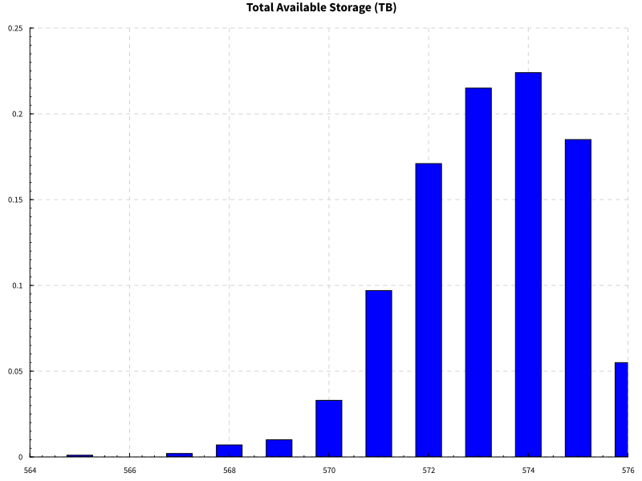
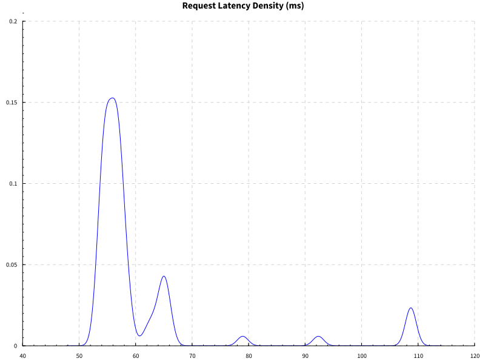

# Hypersphere

> _In geometry of higher dimensions, a hypersphere is the set of points at a
> constant distance from a given point called its center._

Service or infrastructure availability reporting using a probabilistic
model of why things are failing.

## Goals

The goals of this project are to create a reusable library of
functions and data types for modeling and reporting on the
availability of services and/or infrastructure.

 * Creating probabilistic models of service
 * Learning the probability distributions of metrics
 * Defining health checks as simple functions of the model parameters
 * Running the model through some simulations to determine the outcomes
 * Generating reports and graphs to interpret the results

## Basic Overview

There are two types of inputs into the model.
 
 * Things we control
 * Things we observe
 
"Things we control" means things like what hardware we actually have, what
software we have installed on each machine, and our maintenance schedules.

"Things we observe" means things that we measure, disk usage, network
latency, and anything other metrics we collect.

There is some overlap here, i.e. it's perfectly possible to observe what
machines we have, so I'm going to draw another distinction. "Things
we control" are things that we have the power to directly change by
spending money on new hardware, licenses or contracts. By separating these
out from the metrics, we can make a change to this input to determine
the consequences of actually making this change. This lets us answer
questions such as "How does adding a new rack change our availability
story, and is it the most cost efficient way to achieve those results?".

"Things we control" might be represented as a tree like structure of
your hardware, coupled with important metadata such as the mean time to
failure (MTTF) and mean time to repair (MTTR) of the various components.

    data Maintenance = Maintenance
        { mttf :: Double -- Mean Time To Failure
        , mttr :: Double -- Mean Time To Repair
        }
    
    data Cluster = Cluster
        { racks :: Map Name Rack
        }
    
    data Rack = Rack
        { nodes :: Map Name Node
        , rackMaintenance :: Maintenance
        }
    
    data Node = Node
        { disks :: [Disk]
        , nodeMaintenance :: Maintenance
        , role :: [Text]
        }
    
    data Disk = Disk
        { diskMaintenance :: Maintenance
        , diskSize :: Double -- In TB
        }
 
From the "things we control" input we can distil a useful selection of
facts that are useful for determining the cluster status. We can create
a record of these useful facts that might look like this.
 
    data FixedInput = FixedInput
        { blockStorage :: Double
        , numberOfLeaders :: Int
        } deriving (Eq, Ord, Show)
 
But we don't do so directly. We create this input by sampling the "things
we control" structure after taking into account the various distributions
of failure. For this we can use the `maintainCluster` function which goes
through and randomly kills components based on their MTTF and MTTR.
 
    maintainCluster :: MonadSample m => Cluster -> m Cluster
 
Thus, we now have a distribution of `Cluster`s. We are no longer 100%
certain about our total block storage, but we have a distribution of
values that it could be, and their corresponding probabilities. There
is 0% chance that we have more storage than what our input could
provide, but there is a small chance that we have 0 bytes of storage
available, corresponding to the chance that all our machines fail at
the same time. The following is the distribution of total (usable)
disk space for an example cluster (see the [example](example) directory).

 
This alone is not enough for us to know if we have a problem. We need
to also look at the metrics to see if the used block storage is near (or
exceeds!) our total available storage (after taking into account
failures!). So, looking at the above distribution, if our used space
is 150TB, we look pretty safe, but if our used space is 158TB, even if
right now we have the space, there is a relatively high chance that
something could fail at any moment and cause us to be exceeding our
available disk space.
 
Let's step back a moment and look at some metric inputs.
 
    data MetricInput = MetricInput
        { usedStorage :: Double
        , averageRequestLatency :: Double
        } deriving (Show, Eq, Ord)

In this case we are just looking at a few metrics. But once again,
a metric is not a fixed point, it is a distribution. We learn the
distribution of the metrics over different time frames (1 day, 1 week,
1 month) and we input those into the model. So our used block storage
might be normally distributed about 150TB, with a standard deviation
of 5TB. This would be a risky situation to be in. If our disk usage
can fluctuate that much, then we are not in a safe position, especially
because our available disk also fluctuates. So even though we might be OK
right now, we are statistically not OK and are in urgent need of either
buying more disk, or deleting more data.

When running the model, we have to feed in a probability distribution for
our metrics. This is something that we should observe, rather than something
that we should guess. In order to make this process easier, hypersphere
comes with some utilities for non-parametric distributions. We can use
a Kernel Density Estimator (KDE) to come up with a suitable distribution
to be used in the model. Here is a KDE of request latency based on
the observations in [example/request_latency.dat](example/request_latency.dat).

 
Deciding if we are up or down is done by performing a bunch of health
checks which return the status of the cluster. The status of the cluster
is a set of reasons why the cluster is currently not OK. The aim is
for that set to be empty. Health checks are defined using the `Check`
monad. An example of some health checks might be the following.
 
    healthChecks :: FixedInput -> MetricInput -> Check ()
    healthChecks FixedInput{..} MetricInput{..} = do
    
        check "Storage Space Low" $
            (usedStorage / blockStorage) < 0.9
    
        check "Average Request Latency High" $
            averageRequestLatency < 100.0

        check "Network Bandwidth saturated" $
            peakNetworkThroughput < 35.0 -- Gb/s
 
The health checks are actually performed on the distribution of the
inputs, rather than a concrete instance, but we don't care about that
when defining the checks themselves.

The end result of all this is that we can generate a report that looks
like this

    Service is up with probability: 0.940
 
    Risk items:
        0.095	1 - Storage Space Low
        0.021	3 - Network Bandwidth saturated
        0.014	2 - Average Request Latency High
 
The report contains the probability that everything is OK over the time
period that was aggregated over. It also includes the risk items sorted
by their probability of occurring.

The probability that the service was up should correspond to your service
level agreements (SLA). If you have an SLA of 99% uptime in a given month,
then you want that number to be above 99% for your monthly aggregation.
